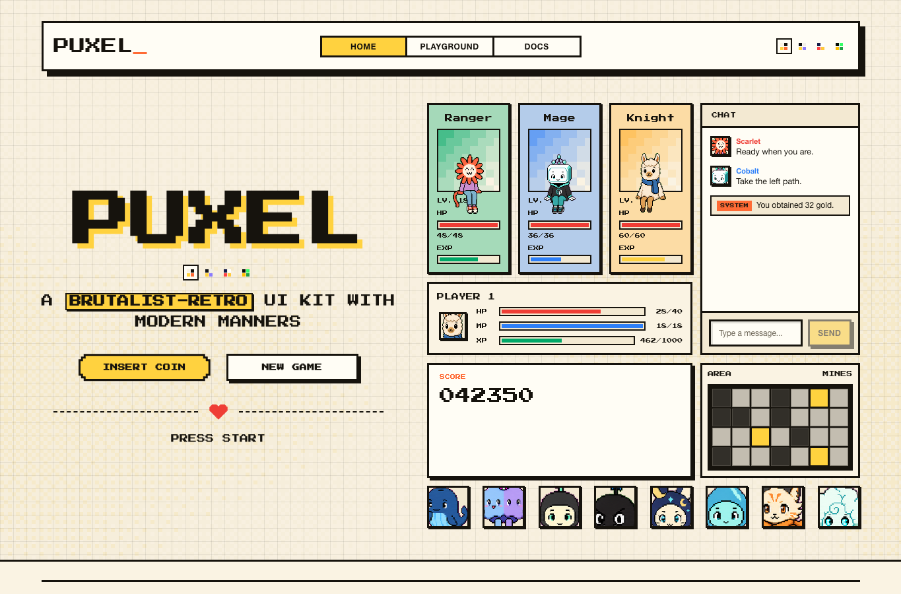
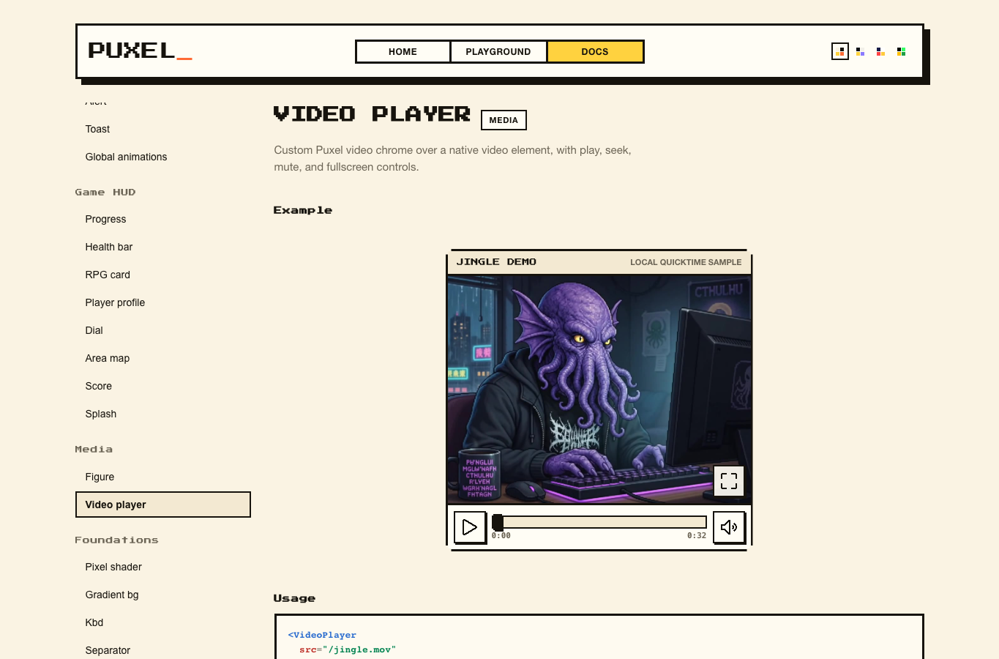

# Puxel

A brutalist-retro UI kit for React — hard offset shadows, thick borders and pixel-font
accents on top of fully modern components (keyboard navigation, ARIA, reduced-motion
support, native `<dialog>`).

**Live demo and docs:** <https://lumpenspace.github.io/puxel/>





## Design

The styling is **CSS-first**: everything lives in plain CSS under `src/styles/`
(`.px-*` classes, themed via CSS variables), and the React components in
`src/components/` are thin typed wrappers that add behavior. You can use the CSS
without React, and the React API without writing any CSS.

### Themes

Set `data-theme` on any ancestor (usually `<html>`), or use `ThemeProvider` /
`ThemeSwitcher`:

| Theme | Vibe |
| --- | --- |
| `paper` (default) | Cream + ink, punchy yellow/orange accents |
| `midnight` | Near-black, off-white ink, yellow + violet |
| `arcade` | NES deep blue, cabinet red + coin gold |
| `terminal` | CRT phosphor green on black, mono body font |

### Components

Buttons, badges, highlights, icons, avatars, animated sprite avatars, spinner ·
inputs, textarea, select, checkbox, radio, switch, slider, field, fieldset
(title-on-border), arcade/high-score form styling · card, character card,
popover, chat, alert, toast, tabs, accordion, table, dialog, dropdown menu,
tooltip, breadcrumb, pagination · progress, segmented health/MP/XP bars, turn
dial, RPG card, player profile, area map, arcade score, stat, splash screen ·
figure, video player, gradient background, pixel shader · kbd, separator.

Opt-in flourishes: `.px-pixelated` (stepped 8-bit corners), `.px-crt` (scanline
overlay), `pixel` prop (Press Start 2P font).

## App

The Vite showcase has three first-class surfaces:

- **Home** — composed component showcase with themes, HUD pieces, chat, sprites,
  icons, forms, containers, and media.
- **Playground** — interactive controls for component states. The Media tab uses
  the hosted jingle video in the `VideoPlayer` demo.
- **Docs** — searchable in-app component docs, examples, usage snippets, and prop
  tables generated from the React components.

## Develop

```sh
npm install
npm run dev     # showcase app with theme switcher
npm run build
npm run build:lib
npm run docs:props
npm run previews
```

`npm run build` writes the GitHub Pages/showcase app to `dist/app/`.
`npm run build:lib` writes the npm package build and declarations under `dist/`.
Re-run `npm run docs:props` whenever component props change.

## Use in your app

```tsx
import "puxel/styles.css";
import { ThemeProvider, Button, HealthBar } from "puxel";

<ThemeProvider defaultTheme="arcade">
  <Button variant="primary" pixel>Insert coin</Button>
  <HealthBar kind="hp" value={7} max={10} />
</ThemeProvider>
```

## License

MIT.
